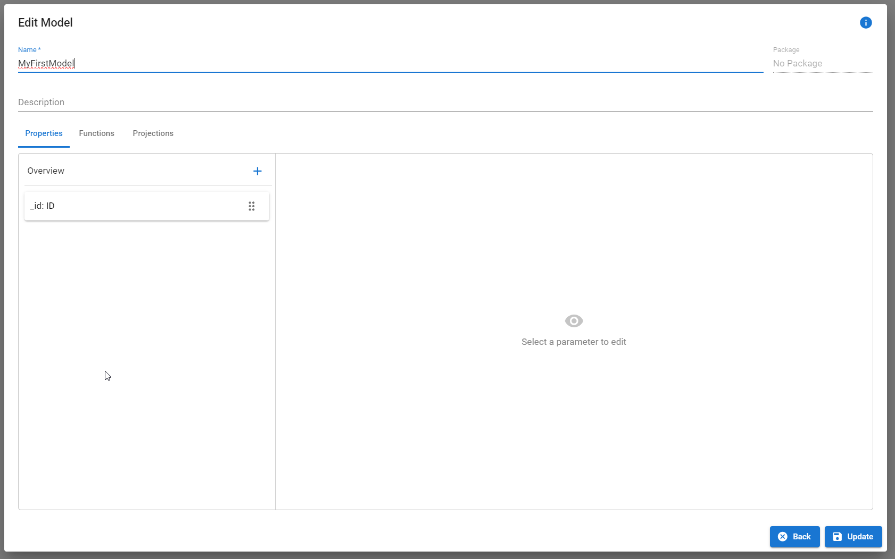

# Functions

## CRUD

***

For each model, multiple `READ`, `UPDATE`, and `DELETE` functions can be created, but only one `CREATE` function.

<table><thead><tr><th width="150">Function</th><th width="180">HTTP-Method</th><th>Description</th></tr></thead><tbody><tr><td><code>CREATE</code></td><td><code>POST</code></td><td>Creates a new database entry of the model and returns it to the client.</td></tr><tr><td><code>READ</code></td><td><code>GET</code></td><td>Finds a single database entry of the model by a path and/or query parameters and returns it to the client.</td></tr><tr><td><code>READ_ALL</code></td><td><code>GET</code></td><td>Finds multiple database entries of the model and returns it to the client. Can be specified by query parameters.</td></tr><tr><td><code>UPDATE</code></td><td><code>PUT</code></td><td>Updates an existing database entry and returns it to the client. Can be specified by path and query parameters.</td></tr><tr><td><code>DELETE</code></td><td><code>DELETE</code></td><td>Deletes an existing database entry and returns it to the client. Can be specified by path and query parameters.</td></tr></tbody></table>


### Path Parameter

Path parameters can be used to adapt and specify single operations. When creating a CRUD function, the path parameter "\_id" is used by default. This parameter can be replaced with another property of a model. A _path parameter_ corresponds to an equals query.The following property types are currently supported:

| Type        | Example                 | Description                                                                                                                                                             |
| ----------- | ----------------------- | ----------------------------------------------------------------------------------------------------------------------------------------------------------------------- |
| Boolean     | /persons/_hasJob_       | Return all peoplewith a job. The Model `Person`contains a boolean property called `hasJob`.                                                                             |
| Text        | /persons/_name_         | Return all people with the same name. The Model `Person` contains a text property called `name`.                                                                        |
| Enumeration | /persons/_gender_       | Return all people with the same gender. The Model `Person` contains a reference to an Enum called `gender`.                                                             |
| Integer     | /persons/_age_          | Return all people within the same age. The Model `Person` contains an int property called `age`.                                                                        |
| Float       | /persons/_money_        | Return all people within the same bank balance. The Model `Person` contains a float property called `money`.                                                            |
| Date        | /persons/_birthdate_    | Return all people within the same birthdate. The Model `Person` contains a date property called `birthdate`.                                                            |
| File        | /person/profil\_picture | Return a person with a certain profile picture. The Model `Person` contains a file property called `profil_picture`. The file `_id` needs to be used as the value here. |

During the execution of the REST call, a value must be provided instead of the property:

**Example:**

```
# Give me all the people who are 24 years old.
/persons/24
```


Location is currently not supported.



At the current time, only one path parameter is allowed



### Query Parameter

Query parameters are used as search criteria or filtering options. They allow users to dynamically modify the content they receive by including key-value pairs, like `?name="Stephen"&age=24`, in the URL. At the moment, VisualBoost provides the nine different query operations, that can be specified in the `Path` input field of your CRUD function.

<figure><figcaption></figcaption></figure>

#### Operators:

<table><thead><tr><th width="190">Query</th><th width="115" align="center">Operator</th><th>Example</th><th>Description</th></tr></thead><tbody><tr><td><code>EQUAL</code></td><td align="center">=</td><td>/persons?name=</td><td></td></tr><tr><td><code>NOT_EQUAL</code></td><td align="center">!=</td><td>/persons?name!=</td><td></td></tr><tr><td><code>LOWER</code></td><td align="center">&#x3C;</td><td>/persons?age&#x3C;</td><td></td></tr><tr><td><code>LOWER_THAN</code></td><td align="center">&#x3C;=</td><td>/persons?age&#x3C;=</td><td></td></tr><tr><td><code>GREATER</code></td><td align="center">></td><td>/persons?name></td><td></td></tr><tr><td><code>GREATER_THAN</code></td><td align="center">>=</td><td>/persons?age>=</td><td></td></tr><tr><td><code>IN</code></td><td align="center">.in()</td><td>/persons?age.in()</td><td></td></tr><tr><td><code>REGEX</code></td><td align="center">.regex()</td><td>/persons?name.regex()</td><td>Only for text properties</td></tr><tr><td><code>NEAR</code></td><td align="center">.near()</td><td>/persons?location.near()</td><td>Only for location properties</td></tr></tbody></table>

Static Values

<mark style="color:purple;">Still in progress....</mark>


## Extensions (Custom Functions)

VisualBoost makes it easy to customize your application and add your own business logic by allowing you to create Extensions. These Extensions are custom REST routes that can run their own unique functionality and are linked to specific models. For each model, you can add as many REST routes as you need. You can also synchronize these Extensions with VisualBoost, ensuring they fully integrate into your software architecture. Once synchronized, your Extensions will automatically be included in the documentation.&#x20;


We recommend using the [VisualBoost plugin](../../../plugin/extensions.md) to create extensions easily and comfortably.


Each Extension is part of a JavaScript file named after the corresponding model. To ensure it is recognized during synchronization, this file must be placed in the Extensions folder, which can be set in VisualBoost’s settings.&#x20;



```javascript
const router = require("express").Router();
const mongoose = require("mongoose");
const Person = require("../../db/generated/Person");

/**
 * Get a persons' name
 *
 * @name: getName
 *
 * @return: {
 *      name: String
 * }
 *
 * @errors: {
 *     400: "Bad Request",
 *     404: "Not found",
 *     500: "Internal Server Error"
 * }
 *
 **/
router.get("/person/name", async (req, res, next) => {

    return res.json({
        name: "John Doe"
    })

});

module.exports = router;
```



<figure><figcaption><p>The analyzed extension after exectuing synchronization</p></figcaption></figure>



The example above demonstrates how to set up an extension. The main difference from a standard [express ](https://expressjs.com)route are the annotations within the comment block. These annotations help analyze the route during the synchronization process. Once analyzed, the route is integrated into the software architecture in VisualBoost. This ensures the architecture remains complete, even with custom business logic. Additionally, this feature can be reused for creating interface documentation and generating client code.

### Annotations

VisualBoost provides 4 different annotations:

<table><thead><tr><th width="175">Annotation</th><th>Description</th><th width="255">Available in HTTP Method</th></tr></thead><tbody><tr><td><strong>@name:</strong></td><td>The functions name.</td><td><code>GET</code>, <code>POST</code>, <code>PUT</code>, <code>DELETE</code></td></tr><tr><td><strong>@body:</strong></td><td>The request body of the route.</td><td><code>POST</code>, <code>PUT</code>, <code>DELETE</code></td></tr><tr><td><strong>@return:</strong></td><td>The response body of the route.</td><td><code>GET</code>, <code>POST</code>, <code>PUT</code>, <code>DELETE</code></td></tr><tr><td><strong>@errors:</strong></td><td>The errors that can be thrown by the route.</td><td><code>GET</code>, <code>POST</code>, <code>PUT</code>, <code>DELETE</code></td></tr></tbody></table>


### Annotation values:

The annotations **@body** and **@return** can be used to define the request and response bodies of a route. The following data types are supported:

<table><thead><tr><th width="175">Type</th><th width="245">Description</th><th>Example</th></tr></thead><tbody><tr><td><strong>Boolean</strong></td><td>Send or return a single boolean value</td><td><pre><code>@return: Boolean
</code></pre></td></tr><tr><td><strong>Int</strong></td><td>Send or return a single integer value</td><td><pre><code>@return: Int
</code></pre></td></tr><tr><td><strong>Float</strong></td><td>Send or return a single float value</td><td><pre><code>@return: Float
</code></pre></td></tr><tr><td><strong>String</strong></td><td>Send or return a single string value</td><td><pre><code>@return: Stringation
</code></pre></td></tr><tr><td><strong>Date</strong></td><td>Send or return a single date value</td><td><pre><code>@return: Date
</code></pre></td></tr><tr><td><strong>Location</strong></td><td>Send or return a single location value (array with latitude and longitude)</td><td><pre><code>@return: Location
</code></pre></td></tr><tr><td><strong>Enumeration</strong></td><td>Send or return a single enumeration value</td><td><pre><code>@return: Gender(MALE, FEMALE)
</code></pre></td></tr><tr><td><strong>Object</strong></td><td>Send or return a single object </td><td><pre class="language-json"><code class="lang-json">@return: {
     name: String,
     age: Int,
     address: {
         housenumber: Int,
         street: String,
         location: Location
      }
 }
</code></pre></td></tr><tr><td>Array</td><td>Send or return multiple values</td><td><p>Return an array of objects:</p><pre><code>@return: [{
     name: String,
     age: Int,
     address: {
         housenumber: Int,
         street: String,
         location: Location
      }
 }]
</code></pre><p></p><p>Return an array of strings:</p><pre><code>@return: [String]
</code></pre></td></tr></tbody></table>


The annotation for **@errors** requires the following structure:

```
@errors: {
     <http_status_1>: "<error_message_1>,
     <http_status_1>: "<error_message_2>
 }
```

Example:

```
@errors: {
    400: "Bad Request",
    404: "Not found",
    500: "Internal Server Error"
}
```


Be sure that the last error message does not end with a comma. If it does, the synchronization process may produce incorrect results.

