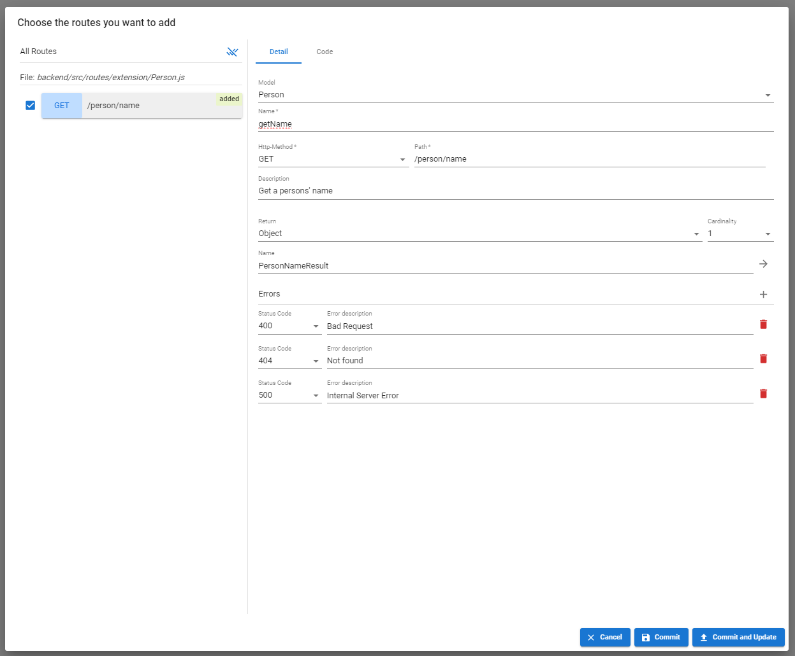

# Extension

VisualBoost makes it easy to customize your application and add your own business logic by allowing you to create Extensions. These Extensions are custom REST routes that can run their own unique functionality and are linked to specific models. For each model, you can add as many REST routes as you need. You can also synchronize these Extensions with VisualBoost, ensuring they fully integrate into your software architecture. Once synchronized, your Extensions will automatically be included in the documentation. 


We recommend using the [VisualBoost plugin](../../../plugin-coming-soon/extensions.md) to create extensions easily and comfortably.


Each Extension is part of a JavaScript file named after the corresponding model. To ensure it is recognized during synchronization, this file must be placed in the Extensions folder, which can be set in VisualBoost’s settings. 



```javascript
const router = require("express").Router();
const mongoose = require("mongoose");
const Person = require("../../db/generated/Person");

/**
 * Get a persons' name
 *
 * @name: getName
 *
 * @return: {
 *      name: String
 * }
 *
 * @errors: {
 *     400: "Bad Request",
 *     404: "Not found",
 *     500: "Internal Server Error"
 * }
 *
 **/
router.get("/person/name", async (req, res, next) => {

    return res.json({
        name: "John Doe"
    })

});

module.exports = router;
```



<figure><figcaption><p>The analyzed extension after exectuing synchronization</p></figcaption></figure>



The example above demonstrates how to set up an extension. The main difference from a standard [express ](https://expressjs.com)route are the annotations within the comment block. These annotations help analyze the route during the synchronization process. Once analyzed, the route is integrated into the software architecture in VisualBoost. This ensures the architecture remains complete, even with custom business logic. Additionally, this feature can be reused for creating interface documentation and generating client code.

### Annotations

VisualBoost provides 4 different annotations:

<table><thead><tr><th width="175">Annotation</th><th>Description</th><th width="255">Available in HTTP Method</th></tr></thead><tbody><tr><td><strong>@name:</strong></td><td>The functions name.</td><td><code>GET</code>, <code>POST</code>, <code>PUT</code>, <code>DELETE</code></td></tr><tr><td><strong>@body:</strong></td><td>The request body of the route.</td><td><code>POST</code>, <code>PUT</code>, <code>DELETE</code></td></tr><tr><td><strong>@return:</strong></td><td>The response body of the route.</td><td><code>GET</code>, <code>POST</code>, <code>PUT</code>, <code>DELETE</code></td></tr><tr><td><strong>@errors:</strong></td><td>The errors that can be thrown by the route.</td><td><code>GET</code>, <code>POST</code>, <code>PUT</code>, <code>DELETE</code></td></tr></tbody></table>


### Annotation values

The annotations **@body** and **@return** can be used to define the request and response bodies of a route. The following data types are supported:

<table><thead><tr><th width="175">Type</th><th width="245">Description</th><th>Example</th></tr></thead><tbody><tr><td><strong>Boolean</strong></td><td>Send or return a single boolean value</td><td><pre><code>@return: Boolean
</code></pre></td></tr><tr><td><strong>Int</strong></td><td>Send or return a single integer value</td><td><pre><code>@return: Int
</code></pre></td></tr><tr><td><strong>Float</strong></td><td>Send or return a single float value</td><td><pre><code>@return: Float
</code></pre></td></tr><tr><td><strong>String</strong></td><td>Send or return a single string value</td><td><pre><code>@return: Stringation
</code></pre></td></tr><tr><td><strong>Date</strong></td><td>Send or return a single date value</td><td><pre><code>@return: Date
</code></pre></td></tr><tr><td><strong>Location</strong></td><td>Send or return a single location value (array with latitude and longitude)</td><td><pre><code>@return: Location
</code></pre></td></tr><tr><td><strong>Enumeration</strong></td><td>Send or return a single enumeration value</td><td><pre><code>@return: Gender(MALE, FEMALE)
</code></pre></td></tr><tr><td><strong>Object</strong></td><td>Send or return a single object </td><td><pre class="language-json"><code class="lang-json">@return: {
     name: String,
     age: Int,
     address: {
         housenumber: Int,
         street: String,
         location: Location
      }
 }
</code></pre></td></tr><tr><td><strong>Array</strong></td><td>Send or return multiple values</td><td><p>Return an array of objects:</p><pre><code>@return: [{
     name: String,
     age: Int,
     address: {
         housenumber: Int,
         street: String,
         location: Location
      }
 }]
</code></pre><p></p><p>Return an array of strings:</p><pre><code>@return: [String]
</code></pre></td></tr></tbody></table>


The annotation for **@errors** requires the following structure:

```
@errors: {
     <http_status_1>: "<error_message_1>,
     <http_status_1>: "<error_message_2>
 }
```

Example:

```
@errors: {
    400: "Bad Request",
    404: "Not found",
    500: "Internal Server Error"
}
```


Be sure that the last error message does not end with a comma. If it does, the synchronization process may produce incorrect results.

