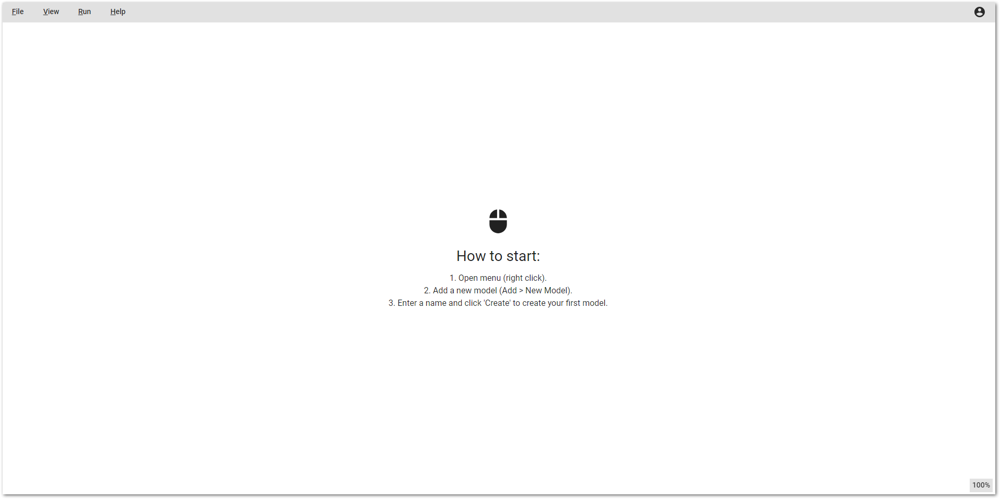

# Model-Editor

The Model Editor is a tool used to design system architecture. It allows for the creation of models, classes, enumerations, and packages. With the Model Editor, users can effectively structure and organize their system components.

* **Model:** Definition of a data type, which can be extended with CRUD functions.
* **Class:** Can be used to define nested data structures.
* **Enumeration:** Constant values.
* **Package:** Used to define a project structure.

<figure><figcaption></figcaption></figure>
