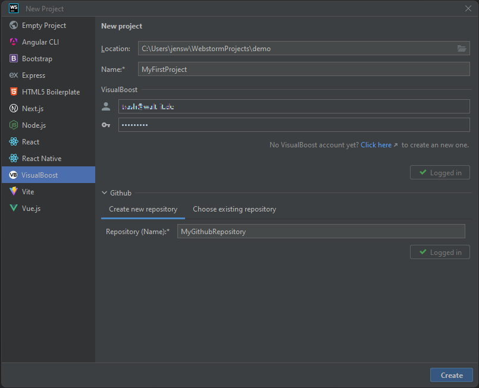

# Create Project

The VisualBoost plugin helps software developers efficiently create new projects. The result is a fully functional Node.js backend application that can be extended and customized using VisualBoost within the WebStorm IDE.

## **How to create a new project:**

To create a new project, simply click on **File -> New -> Project** inside the WebStorm IDE and select **VisualBoost**. The following information is required to create a new project:

* **Location (Required):** The directory where your VisualBoost project will be stored.
* **Name (Required):** The name of your VisualBoost project.&#x20;
* **Credentials:** Enter the email address and password for your VisualBoost account and click _Login_.
* **GitHub:** Click _Login_ to open the GitHub login app. Enter your credentials and proceed. After successfully logging into GitHub, you can either create a new repository for your VisualBoost project or select an existing one. The repository will be automatically connected to your VisualBoost project and will contain the source code.

<figure><figcaption></figcaption></figure>

After entering the required information, click **Create** to initiate the following processes:

1. A new VisualBoost project will be created.
2. If **Create new repository** is selected, a new Git repository will be generated.
3. The repository will be linked to the VisualBoost project.
4. The repository will be cloned locally.
5. Development environment variables will be configured (these variables will be excluded from version control in Git).
6. The database will be set up.
7. The Node.js application will be configured.
8. Run configurations will be provided within your WebStorm IDE.

<figure><figcaption></figcaption></figure>

The provided application is fully executable and can be put into operation by first running **Start Database** and then **Start Application**.

> Note: A running Docker engine and having npm installed are prerequisites for starting the application.
