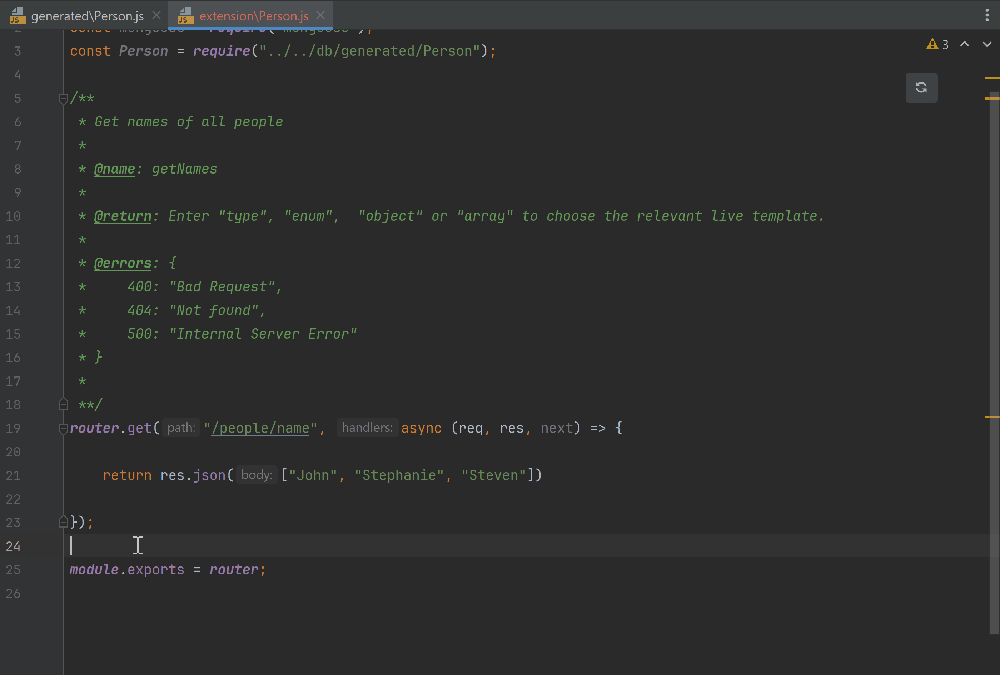

# Extensions

VisualBoost makes it easy to customize your application and add your own business logic by allowing you to create [Extensions](../model-editor/model/functions/extension.md). These Extensions are custom REST routes that can run their own unique functionality and are linked to specific models. For each model, you can add as many REST routes as you need. You can also synchronize these Extensions with VisualBoost, ensuring they fully integrate into your software architecture. Once synchronized, your Extensions will automatically be included in the documentation. 

Each Extension is part of a JavaScript file named after the corresponding model. To ensure it is recognized during synchronization, this file must be placed in the Extensions folder, which can be set in VisualBoost’s settings. 

The plugin automates these steps, making it easy to add an Extension. Simply right-click on the root folder, select **File -> Extension** and choose the model for which you want to create the Extension.

<figure><figcaption>
Creating a new extension
</figcaption></figure>

## Add Extensions

To add a new extension you can use one of the following [Live Templates](https://www.jetbrains.com/help/webstorm/using-live-templates.html#live\_templates\_types) within the Javascript File:



<figure><figcaption>
Add a GET extension
</figcaption></figure>



<figure><figcaption>
Add a POST extension
</figcaption></figure>



<figure><figcaption>
Add a PUT extension
</figcaption></figure>



<figure><figcaption>
Add a DELETE extension
</figcaption></figure>



## Define types

To simplify the definition of the **@body**, **@return**, and **@errors** [annotations](../model-editor/model/functions/extension.md#annotation-values), the plugin offers additional templates for defining data types and error structures.&#x20;

### @body and @return templates

The VisualBoost Plugin contains the following Live Templates to easily add the [supported datatypes](../model-editor/model/functions/extension.md#annotation-values) to the extensions.



<figure><figcaption></figcaption></figure>



<figure><figcaption></figcaption></figure>




<figure><figcaption></figcaption></figure>




<figure><figcaption></figcaption></figure>




### @errors

The VisualBoost Plugin contains the Live Template **@errors** to easily define the errors of a route.

<figure><figcaption></figcaption></figure>

## Synchronize with VisualBoost

Click the **synchronization button** in your Webstorm editor to synchronize the Extension with VisualBoost.

<figure><figcaption></figcaption></figure>
